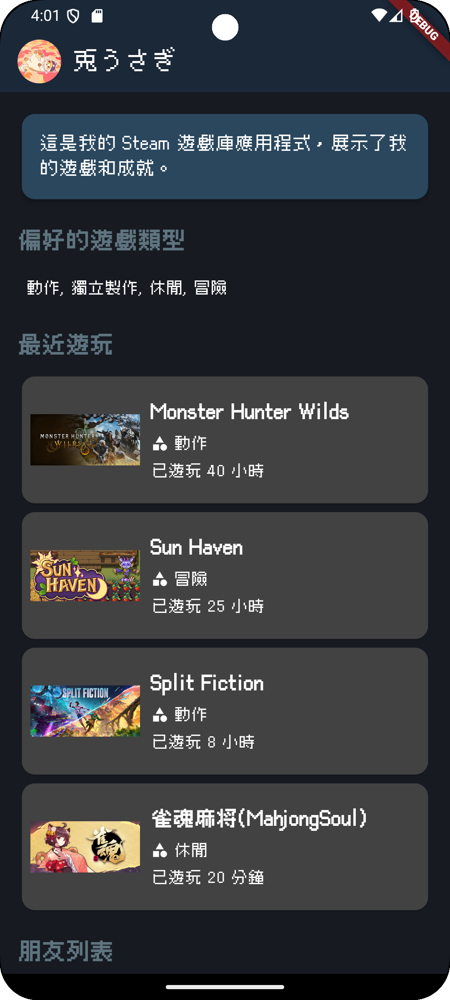
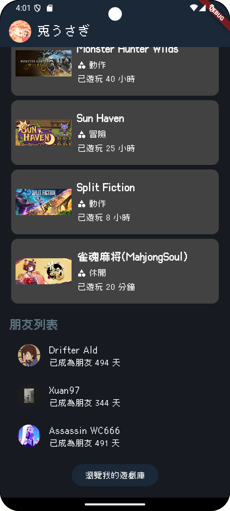
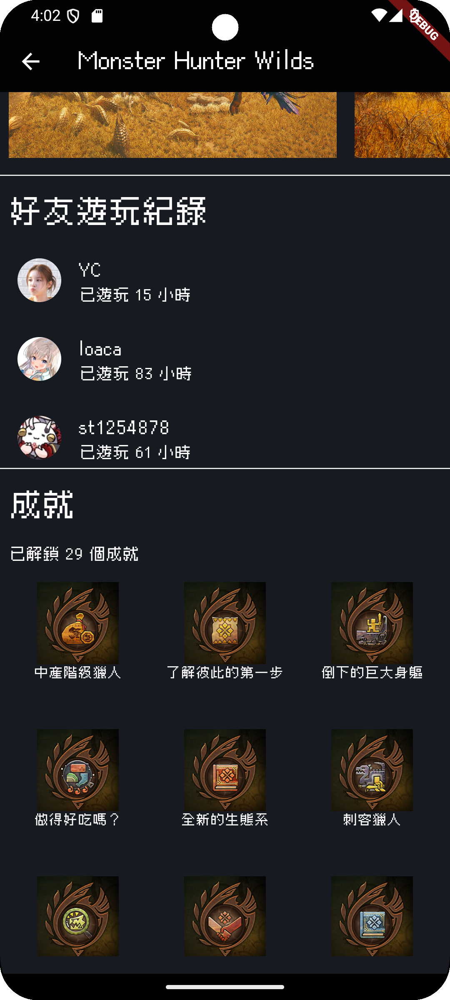
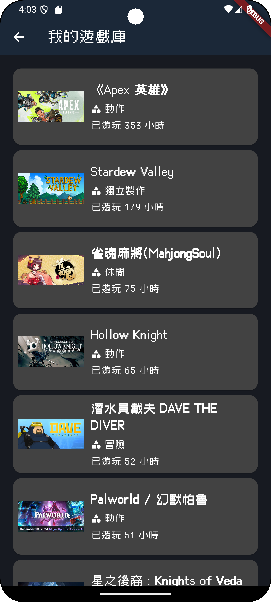

# 我的遊戲庫

這是一個 Flutter 應用程式，展示了我的 Steam 遊戲庫和成就。使用 Steam API 獲取遊戲數據、成就和好友資訊，並顯示在美觀的界面中。

## 功能

- 顯示最近遊玩的遊戲
- 顯示偏好的遊戲類型
- 顯示好友列表及其最近遊玩的遊戲
- 顯示遊戲詳情，包括遊戲圖片和成就

## 使用技術

- Flutter
- Dart
- HTTP 請求
- Steam API

## 安裝

1. 確保已安裝 Flutter SDK。
2. 克隆此專案：
   ```sh
   git clone https://github.com/yourusername/flutter_application_1.git
   ```
3. 進入專案目錄：
   ```sh
   cd flutter_application_1
   ```
4. 安裝依賴：
   ```sh
   flutter pub get
   ```

## 運行

1. 連接模擬器或實體設備。
2. 運行應用程式：
   ```sh
   flutter run
   ```

## 文件結構

- `lib/main.dart`：應用程式的入口文件，包含主頁面和遊戲庫頁面。
- `lib/game.dart`：定義遊戲數據模型。
- `lib/game_card.dart`：顯示遊戲卡片的組件。
- `lib/game_detail.dart`：顯示遊戲詳情的頁面。
- `lib/steam_service.dart`：與 Steam API 交互的服務。
- `lib/steam_scraper.dart`：從 Steam 網頁解析遊戲圖片的工具。

## 截圖





